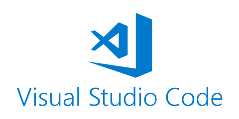

<link href="style.css" rel="stylesheet"></link>

# RECURSOS
Repositorio para agrupar comandos, tutoriales y recursos varios relacionados con el mundo de la programación.

Desde aquí se puede acceder a las diferentes secciones:

|Nombre                |Descripción                          |Logo                         |
|----------------|-------------------------------|-----------------------------|
|<a href="/GitHub">GIT y GITHUB</a>|`'Isn't this fun?'`            |            |
|<a href="/Bash">BASH</a>|||
|<a href="/VSCode">VISUAL STUDIO CODE</a>|`"Isn't this fun?"`            ||
|<a href="/Docker">DOCKER</a>|||
|<a href="/HTMLCSS">HTML y CSS</a>|||
|<a href="/Python">PYTHON</a>|||
|<a href="/Arduino">ARDUINO</a>|||

